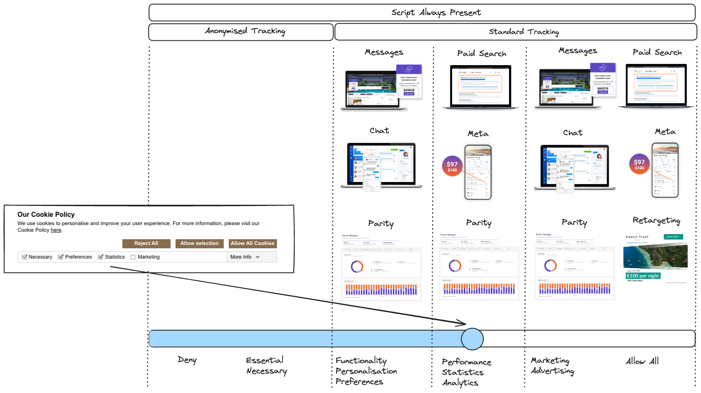
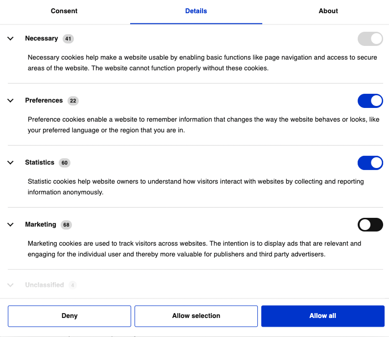

# Consent Mode Guide

**Are you willing to add the Triptease script all the time, prior to displaying the cookie banner, and regardless of consent chosen on the cookie banner, as long as we adjust our functionality according to the user's consent?**

If you've answered no because you believe it would violate GDPR compliance, please [review the rationale](https://docs.triptease.io/cookie-banner#compliance-and-privacy) for why it is GDPR-compliant. 

If you've answered yes, consent mode offers a solution to balance your compliance obligations with maximising the value from the products you have invested in.

## What is Consent Mode?

If your website displays a cookie/storage banner for GDPR compliance, you can communicate the user's consent preferences to the Triptease script.
Consent Mode serves as the mechanism for this communication.

It controls the usage of first and third party storage mechanisms of the browser, and which Triptease products run.

When the user chooses to "Deny" cookies or only accept "Essential" cookies, Consent Mode ensures cookieless tracking.

The diagram below shows how Triptease functionality scales based on user consent. 



## What is Automatic Consent Mode?

With automatic consent mode, we can detect the consent chosen on the cookie banner without requiring you to provide it to us.
This is available for supported CMPs.

### Is my Consent Manager Provider (CMP) supported for Automatic Consent Mode?

Currently, the following CMPs are supported:
* CookieBot
* Klaro
* OneTrust
* TrustArc
* Google Consent Mode V2 - If your Consent Manager Provider (CMP) is a Google certified CMP for [Consent Mode V2](https://support.google.com/tagmanager/answer/10718549?hl=en) we can enable automatic consent mode.

Please reach out to us if your CMP is not on this list and does not support Google Consent Mode V2. We can add support for your CMP. 

### How do you enable Automatic Consent Mode?

It is as simple as setting the `data-storage-consent` attribute to `auto` on the Triptease script tag.

#### Your script tag:

```html
<script defer async crossorigin="anonymous" type="text/javascript"
        src="https://onboard.triptease.io/bootstrap.js?integrationId=REPLACE_ME"
        data-storage-consent="auto">
</script>
```

Use the following format with Google Tag Manager (as it removes data attributes): 
```html
<script>
    (function(d,t,u,e,s){
        e=d.createElement(t);
        e.src=u,e.defer=true,e.async=true,e.crossOrigin='anonymous';
        e.type='text/javascript';
        e.setAttribute('data-storage-consent','auto');
        s=d.getElementsByTagName(t)[0];
        s.parentNode.insertBefore(e,s)
    })(document,'script','https://onboard.triptease.io/bootstrap.js?integrationId=REPLACE_ME');
</script>
```

## How do you provide Consent Mode when there is no "auto" support for your CMP?

If we cannot support automatic consent mode, you still have the option of providing the user consent to us.
This will require development work on your end.  

Providing user consent is as simple as setting the `data-storage-consent` attribute on the Triptease script tag. 
Note that the value should not be hardcoded in your HTML (or Tag Manager etc.) but should be based on the user's choices on the cookie banner.  

#### Example:

```html
<script defer async crossorigin="anonymous" type="text/javascript"
        src="https://onboard.triptease.io/bootstrap.js?integrationId=REPLACE_ME"
        data-storage-consent="marketing">
</script>
```

The attribute can be set or updated. Triptease script will automatically detect a change in the attribute and ensure that the storage mechanisms used and products loaded are as per the updated value. 

This attribute can have any of the following values: `none`, `essential`, `functionality`, `performance`, `marketing`, `all`

Multiple values can also be provided. e.g. `essential, functionality, performance` which would combine the applications allowed.

#### Example:

```html
<script defer async crossorigin="anonymous" type="text/javascript"
        src="https://onboard.triptease.io/bootstrap.js?integrationId=REPLACE_ME"
        data-storage-consent="functionality, performance">
</script>
```

### How do you map your user's cookie choices to the consent modes?

We have listed the terms typically used in cookie banners, grouping the common aliases together, in the table below. Please use this as a guide.   

| Chosen on Cookie Banner                       | Consent Mode to Use |
|-----------------------------------------------|---------------------|
| Deny                                          | `none`              |
| Essential / Necessary                         | `essential`         |
| Functionality / Personalisation / Preferences | `functionality`     |
| Performance / Statistics / Analytics          | `performance`       |
| Marketing / Advertising                       | `marketing`         |
| Allow All                                     | `all`               |

Here is a typical example of a cookie banner where the user has selected Necessary, Preferences and Statistics.
You would provide `data-storage-consent="essential, functionality, performance"` in this scenario.  



## What is the default behaviour?

If `data-storage-consent` attribute is absent, we assume the consent mode is `all`. We consider the addition of our script to be implicit consent in this case.

If `data-storage-consent` attribute is set to `auto` but we are unable to find the consent through the CMPs known to us, we assume the consent mode is `none`. 

## What does each Consent Mode do?

### None

Storage consent `none` can be used *before* the user has given any explicit consent. No Triptease products will be run and no persistent 
browser storage or cookies will be used. If the user closes the browser and then reopens it, Triptease will treat it as two completely 
different users. In effect the browser is automatically forgetting any user when closed.

If the user then gives consent, the `data-storage-consent` attribute should be updated so that the Triptease script can then load the 
correct applications and allow storage access.

| First Party Storage | Third Party Storage | Applications |
|---------------------|---------------------|--------------|
| Denied              | Denied              | None         |

#### Example:

```html
<script ...
        data-storage-consent="none">
</script>
```


### Essential (strictly necessary)

If the user only gives `essential` or strictly necessary storage consent, then Triptease will actually treat this 
in exactly the same way as `none`. So no storage or applications will be allowed. 

We have taken this strict view to align with the [GDPR recommendation](https://gdpr.eu/cookies/) because the litmus test is 
"_Can a user complete a booking journey without Triptease products?_".

| First Party Storage | Third Party Storage | Applications |
|---------------------|---------------------|--------------|
| Denied              | Denied              | None         |

#### Example:

```html
<script ...
        data-storage-consent="essential">
</script>
```

### Functionality (personalisation/preferences)

When `functionality` storage consent is present it will enable all onsite products such as Messages, Price Check and Chat. 

NB: Offsite products will *not* be enabled as they do not provide any additional functionality 
from the user's perspective.


| First Party Storage | Third Party Storage | Allowed Applications                              |
|---------------------|---------------------|---------------------------------------------------|
| Granted             | Granted             | Messages (including Price Check), Parity and Chat |

#### Example:

```html
<script ...
        data-storage-consent="functionality">
</script>
```


### Performance (statistics/analytics)

When `performance` storage consent is present it will enable products that are used to measure the performance
of your website and booking funnel.

NB: User facing onsite products will *not* be enabled 

| First Party Storage | Third Party Storage | Allowed Applications         |
|---------------------|---------------------|------------------------------|
| Granted             | Granted             | Parity, Meta and Paid Search |

#### Example:

```html
<script ...
        data-storage-consent="performance">
</script>
```

### Marketing (advertising) or All 

When `marketing` or `all` storage consent is present it will enable all Triptease products.

| First Party Storage | Third Party Storage | Allowed Applications |
|---------------------|---------------------|----------------------|
| Granted             | Granted             | All                  |

#### Example:

```html
<script ...
        data-storage-consent="marketing">
</script>
```

### What do we mean by Cookie or Storage?

In this document storage refers to cookies and any other web browser technology like localStorage or sessionStorage.
Triptease does not use browser fingerprinting or any other means that cannot be controlled by the end user.
