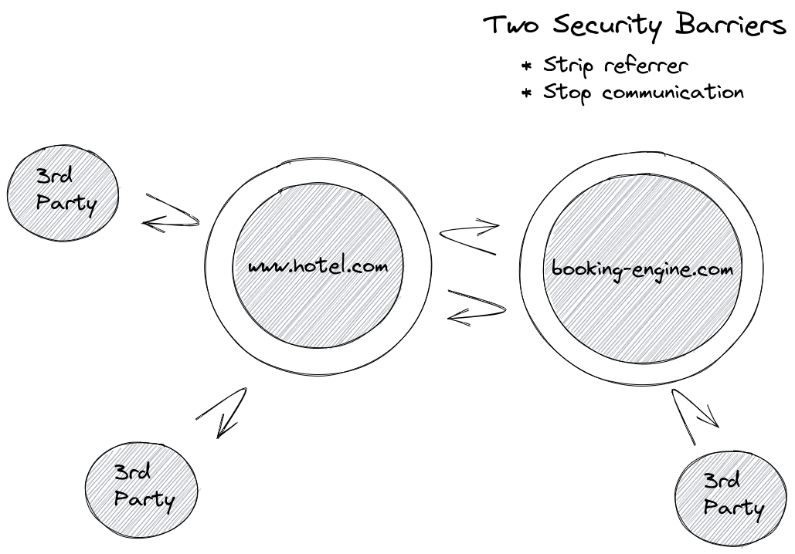
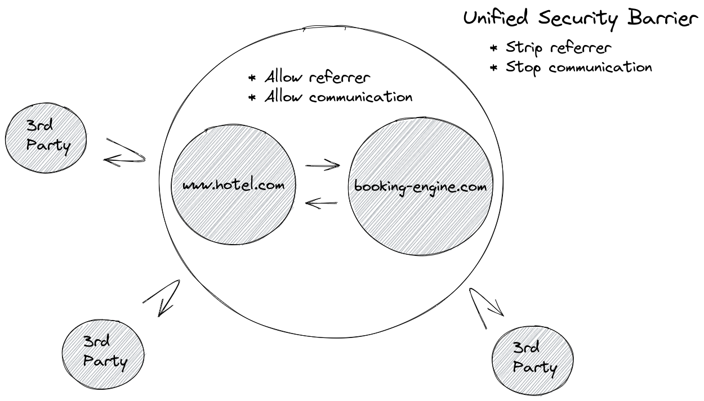

## Cross Domain Analytics

### What is cross domain analytics?

As web security has increased over time, the amount of information shared between different domains has decreased. This
is good as it protects end users from third party attackers as it provides an effective security barrier between
domains.

#### Single Domain:

In the hotel industry it is fairly common to have a separate marketing website and booking engine. By default, this
means those 2 domains also have an effective security barrier between them reducing communication.

#### Two Separate Domains:

**NB: This applies even if you are using subdomains like: [www.hotel.com](http://www.hotel.com) and book.hotel.com.**

The division is an arbitrary because the hotel controls content on both domains, and ideally it would just be a
single domain.

However, it is possible to re-enable communication between the two domains and in effect create a single security
barrier around the outside of the two domains.

#### Two Unified Domains:

### Why would you want to turn this on?

Without enabling cross domain analytics, you will end up having two separate funnels on each domain and double counting
some of your visitors. This will lead to increased visitor count and a decreased visitor conversion rate. This can make
your ecommerce strategy look less effective than it actually is.

Other analytics tools each have their own name for this:

- Google Analytics call
  this [cross domain measurement](https://developers.google.com/analytics/devguides/collection/analyticsjs/cross-domain)
  and address it with their [linker](https://developers.google.com/analytics/devguides/collection/analyticsjs/linker)
- Optimizely call
  this [cross-origin tracking](https://support.optimizely.com/hc/en-us/articles/4410289774349-Cross-origin-tracking-in-Optimizely-Web)

By enabling cross domain analytics, you will be future proofing your analytics in a world without 3rd party cookies
while still being compliant with privacy laws.

### When I turn this on, what does it do?

To reduce developer burden, we will automatically configure the following on all links to your booking engine:

- Allow full referrer across the two domains by setting
  the [referrer policy](https://developer.mozilla.org/en-US/docs/Web/HTTP/Headers/Referrer-Policy) back
  to [no-referrer-when-downgrade](https://developer.mozilla.org/en-US/docs/Web/HTTP/Headers/Referrer-Policy#:~:text=any%20referrer%20information.-,no%2Dreferrer%2Dwhen%2Ddowngrade,-Send%20the%20origin)
  . This will improve Triptease analytics as well as other tools like Google Analytics (especially traffic acquisition
  and funnel / path exploration)
- Ensure `target=”_blank”` and `rel=”opener”` are always set. This allows Triptease to identify the same visitor across
  both windows without using cookies or local storage. This will mean also mean that links to your BE will always open
  in a new window.

### Why don’t you use link decoration like Google Analytics?

In our analysis and testing we have seen many urls that contain a visitor ID being shared freely thereby identifying
multiple different visitors as a single visitor. Also, as single page application become more common we have found that
websites often strip the query parameters before they can be read by your analytics scripts.

### How do you turn this on?

Please reach out to your Customer Success Manager or Direct Booking Coach.