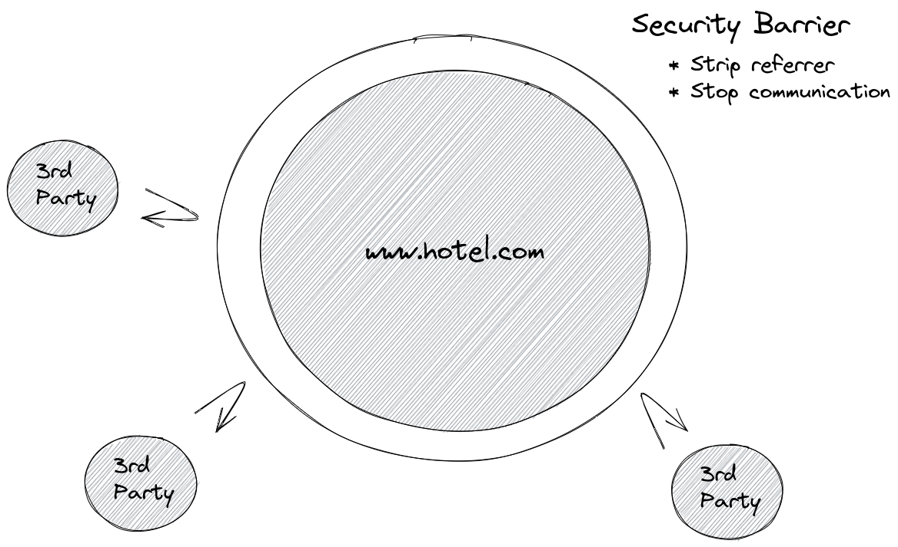

## Cross Domain Analytics

### What is cross domain analytics?

As web security regulation has increased over time, the amount of information shared between different domains has
decreased. This is beneficial to end users as it protects them from third party attackers by providing an effective
security barrier between domains.

#### Single Domain:

In the hotel industry, it is fairly common to have a separate marketing website and Booking Engine. By default, this
means those two domains also have an effective security barrier between them reducing communication.

#### Two Separate Domains:

**NB: This applies even if you are using subdomains like: `www.hotel.com` and `book.hotel.com`.**

The division is arbitrary because the hotel controls content on both domains, and ideally it would just be a single
domain.

However, it is possible to re-enable communication between the two domains, and in effect create a single security
barrier around the outside of the two domains.

#### Two Unified Domains:

### Why you should enable cross domain analytics?

Without enabling cross domain analytics, you will end up having two separate funnels on each domain and risk double
counting some of your visitors. This will result in an inflated visitor count and apparent decreased conversion rate,
meaning your reporting will be inaccurate and appear to be less effective.

Other analytics tools each have their own name for this:

- Google Analytics call
  this [cross domain measurement](https://developers.google.com/analytics/devguides/collection/analyticsjs/cross-domain)
  and address it with their [linker](https://developers.google.com/analytics/devguides/collection/analyticsjs/linker)
- Optimizely call
  this [cross-origin tracking](https://support.optimizely.com/hc/en-us/articles/4410289774349-Cross-origin-tracking-in-Optimizely-Web)

By enabling cross domain analytics, you will future-proof your analytics ahead of the phase out of third party cookies,
while still being compliant with privacy laws.

### When this is turned this on, what does it do?

To reduce developer burden, Triptease will automatically configure the following on all links to your Booking Engine:

- Allow full referrer across the two domains by setting
  the [referrer policy](https://developer.mozilla.org/en-US/docs/Web/HTTP/Headers/Referrer-Policy) back
  to [no-referrer-when-downgrade](https://developer.mozilla.org/en-US/docs/Web/HTTP/Headers/Referrer-Policy#:~:text=any%20referrer%20information.-,no%2Dreferrer%2Dwhen%2Ddowngrade,-Send%20the%20origin)
  . This will improve Triptease analytics as well as other tools like Google Analytics (especially traffic acquisition
  and funnel / path exploration).
- Ensure [target=”_blank”](https://developer.mozilla.org/en-US/docs/Web/HTML/Element/a#attr-target)
  and [rel=”opener”](https://developer.mozilla.org/en-US/docs/Web/HTML/Attributes/rel#attr-opener) are set. This allows
  Triptease to identify the same visitor across both windows without using cookies or local storage. This will mean that
  links to your BE will always open in a new window.

**NB: This should only ever apply to your Booking Engine links and not say another third party like Facebook. Please get
in touch if this is not the case, and we can adjust your setup.**

### Why doesn't Triptease use link decoration like Google Analytics?

We frequently see many URLs that contain a visitor ID being freely shared, thereby incorrectly identifying different
users as one. Also, as single page application becomes more common, we have observed that websites often strip the query
parameters before they can be read by your analytics scripts. This leads to more inaccurate analytics and reports.

### How can I turn on cross domain analytics for my hotel?

Please get in touch with our Customer Success team
at [customersuccess@triptease.com](mailto:customersuccess@triptease.com)