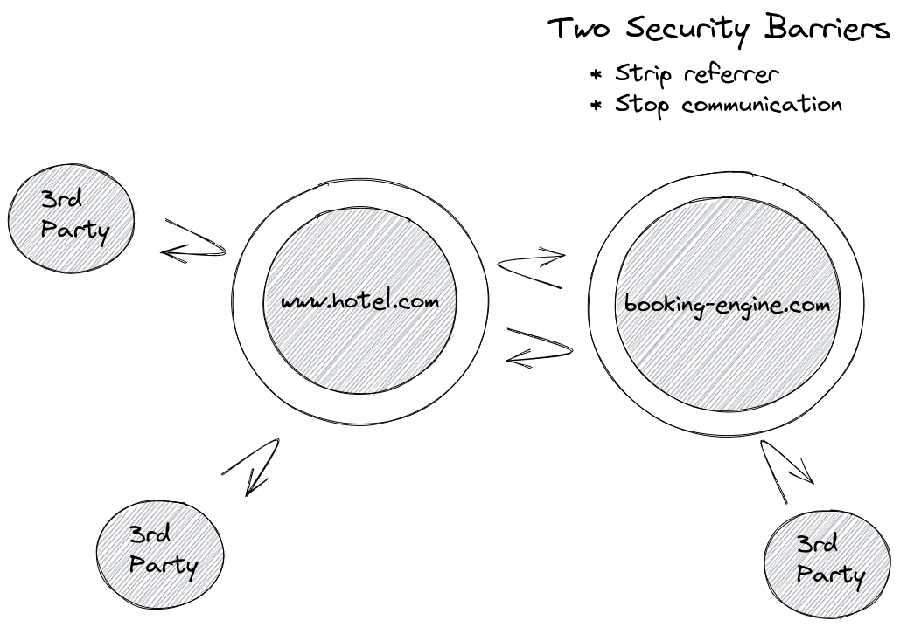

# Cross Origin Tracking

## What is cross-origin tracking?

As web security regulation has increased over time, the amount of information shared between different origins has
decreased. This is beneficial to end users as it protects them from third party attackers by providing an effective
security barrier between origins.

### Single Origin:

In the hotel industry, it is fairly common to have a separate marketing website and Booking Engine. By default, this
means those two origins also have an effective security barrier between them reducing communication.

### Two Separate Origins:

**NB: This applies even if you are using subdomains like: `www.hotel.com` and `reservations.hotel.com` as they are NOT
the [same-origin](https://developer.mozilla.org/en-US/docs/Web/Security/Same-origin_policy).**

The division is arbitrary because the hotel controls content on both origins, ideally it would just be a single origin
and if this was the case, referrer information and communication between pages would just work.

However, it is possible to re-enable communication between the two origins, and in effect create a single security
barrier around the outside of the two origins.

### Two Unified Origins:

## Why you should enable cross-origin tracking?

Without enabling cross-origin tracking, you will end up having two separate funnels on each origin and risk double
counting some of your visitors. This will result in an inflated visitor count and apparent decreased conversion rate,
meaning your reporting will be inaccurate and appear to be less effective.

Traffic acquisition reports that try to identify the source of traffic will also report elevated referral traffic at the
expense of other channels.

Other analytics tools each support this in different ways:

- Google Analytics call
  this [cross origin measurement](https://developers.google.com/analytics/devguides/collection/analyticsjs/cross-origin)
  and address it with their [linker](https://developers.google.com/analytics/devguides/collection/analyticsjs/linker)
- Optimizely also call
  this [cross-origin tracking](https://support.optimizely.com/hc/en-us/articles/4410289774349-Cross-origin-tracking-in-Optimizely-Web)

By enabling cross-origin tracking, you will future-proof your tracking ahead of the phase out of third party cookies,
while still being compliant with privacy laws.

## When this is turned this on, what does it do?

To reduce developer burden, Triptease will automatically configure the following on all links to your Booking Engine:

- Ensure [target=”_blank”](https://developer.mozilla.org/en-US/docs/Web/HTML/Element/a#attr-target) is set so that links
  to your BE open in a new window.
- Ensure [rel=”opener”](https://developer.mozilla.org/en-US/docs/Web/HTML/Attributes/rel#attr-opener) is set so that
  Triptease scripts can communicate across the two separate origins.
- Restore [referrer policy](https://developer.mozilla.org/en-US/docs/Web/HTTP/Headers/Referrer-Policy) back
  to [no-referrer-when-downgrade](https://developer.mozilla.org/en-US/docs/Web/HTTP/Headers/Referrer-Policy#:~:text=any%20referrer%20information.-,no%2Dreferrer%2Dwhen%2Ddowngrade,-Send%20the%20origin)
  so that referrer path and query parameters are not stripped when crossing between the two origins. (This will also
  improve Google Analytics especially traffic acquisition and funnel / path exploration).

**NB: This should only ever apply to your Booking Engine links and not say another third party like Facebook. Please get
in touch if this is not the case, and we can adjust your setup.**

## Why doesn't Triptease always just turn this on?

Normally Triptease does not modify any HTML on your page (excluding adding our scripts and associated widgets) so we
want to make it an explicit decision to change how Booking Engine links work. However, due to the improvements in
tracking and analytics we do recommend this change.

## What could go wrong?

The worst that could happen would be that a link that is not going to your Booking Engine now opens in a new window and
referral data has reverted to pre November 2020 browser behaviour. If you see this happening please report it, and we
will adjust your setup.

## Does this affect GDPR or other privacy requirements?

No, there is no additional data or data processors or processing involved. The only change is that inaccurate data is
reduced, all your previous documentation and privacy statements are still correct.

## Why doesn't Triptease use link decoration like Google Analytics?

We frequently see many URLs that contain a visitor ID (eg: `?_ga=123.456`) being shared between different users, this
means that those separate users can end up being treated as a single user. If those links are shared on social media
then the problem is compounded for every user that clicks the link.

Another issue with this approach is as single page application becomes more common, we see more and more websites that
strip the query parameters before they can be read by your tracking scripts again leading to inaccurate analytics.

Finally, using link decoration in Safari will actually reduce any cookies created via `document.cookie` duration from 7 
days to 24 hours since [ITP 2.2](https://webkit.org/blog/8828/intelligent-tracking-prevention-2-2/)  

## Doesn't using subdomains solve the same problem?

Unfortunately not, subdomains are still treated as separate origins from a web security standpoint. This means that
referrer information is still stripped and communication between windows is still prohibited by default.

The only benefit is that 1st party cookies can be read by any subdomain. While this may improve some tracking, it
unfortunately
presents [serious security and GDPR concerns](https://blog.lukaszolejnik.com/large-scale-analysis-of-dns-based-tracking-evasion-broad-data-leaks-included/)
as most if not all cookies will now be sent to all subdomains possibly leaking PII unintentionally.

## Doesn't using `rel=opener` present similar security concerns?

As [Google points out](https://bughunters.google.com/learn/invalid-reports/web-platform/navigation/5825028803002368)
if you can open a new window or redirect a URL you can launch a phishing attack and the best defense is the browser and
user education. In comparison to using subdomains to allow 3rd party access to all 1st cookies, the attack surface is
minimal, and we believe a much better trade-off.

## What is the difference between an origin, a domain and a subdomain?

Most hotels will own a domain name like `hotel.com` and under this domain they might create multiple subdomains
like `www.hotel.com` or `reservations.hotel.com`. Each of these subdomains will represent a separate origin but can
actually be subdivided further by protocol/schema and even port. For example if you had both an insecure
site `http://www.hotel.com/` and a secure site `https://www.hotel.com/`, these would be considered to be 2 separate
origins.

## How can I turn on cross-origin tracking for my hotel?

Please get in touch with our Customer Success team
at [customersuccess@triptease.com](mailto:customersuccess@triptease.com)