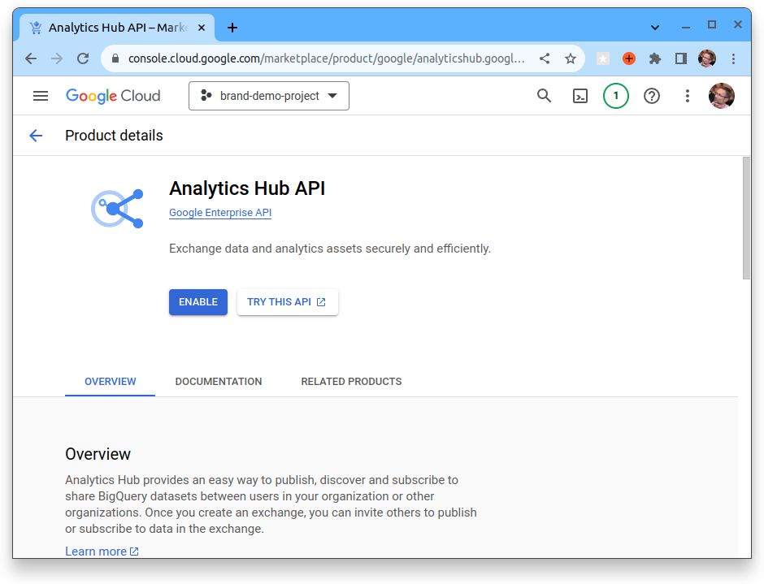
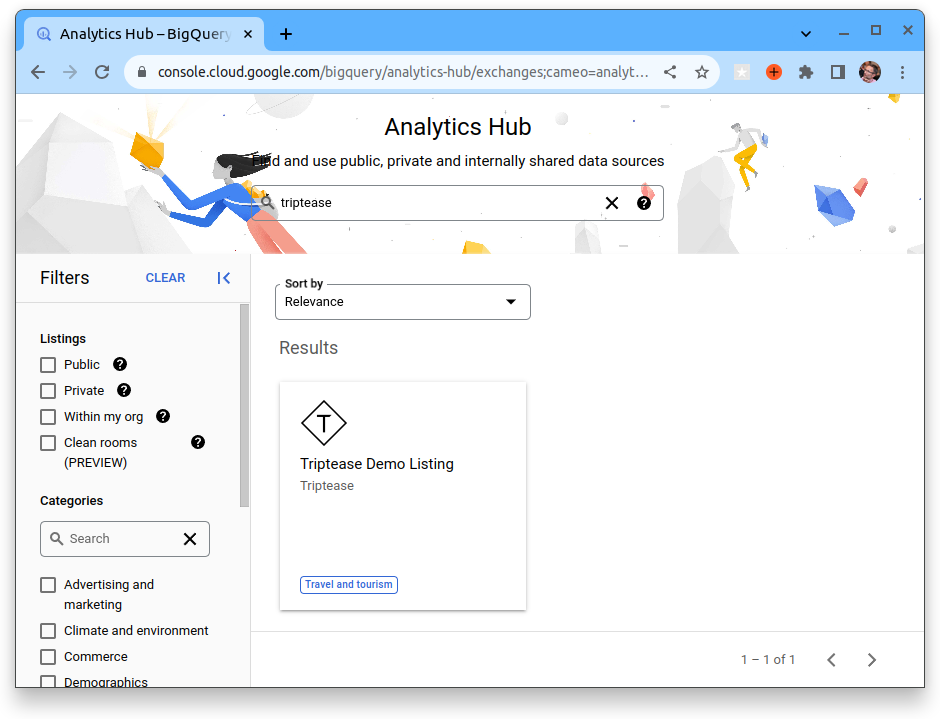
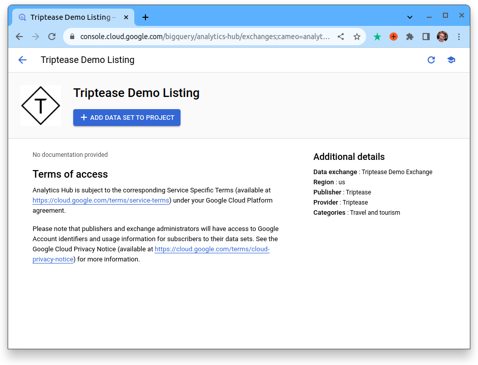
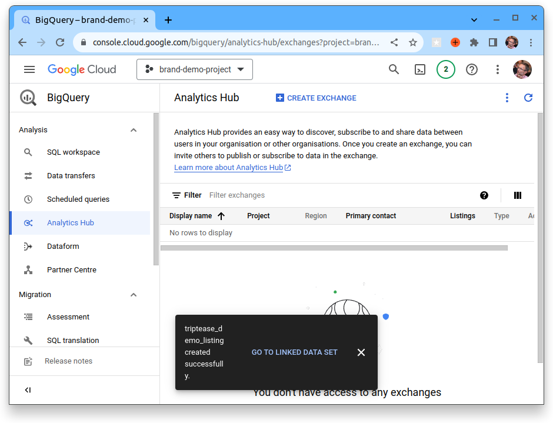
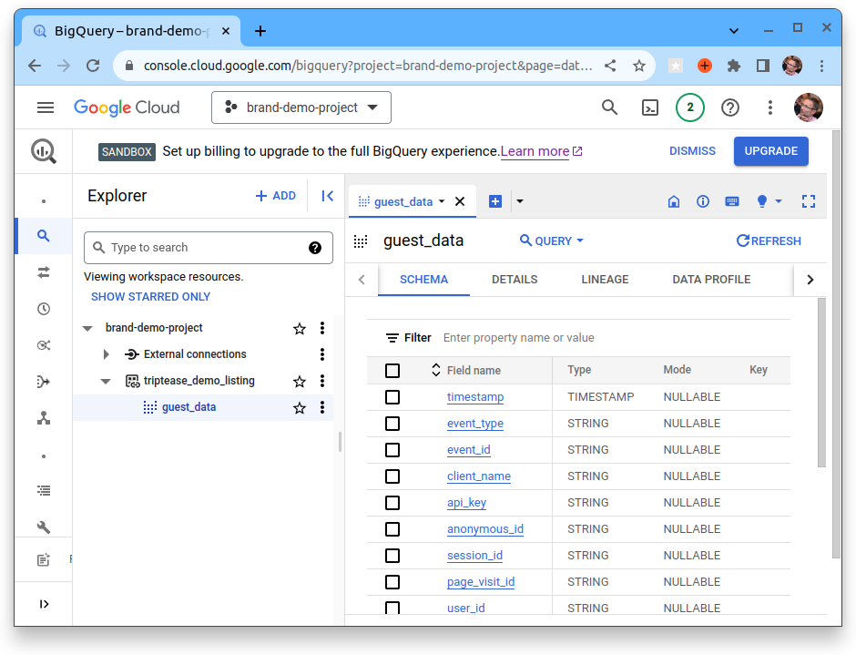

# Data Feed - Setup Instructions

## How is the data shared?

We use Google BigQuery to share our data with our partners. This allows us to share data in a secure and scalable way 
but also allow you to decided how fresh you want the data to be.

### Why BigQuery?

BigQuery provides a number of advantages from an integration perspective:
1. BigQuery is natively supported by all major BI tools (e.g. Tableau, Looker, PowerBI, Qlik etc.)
2. Storage and query costs are separate, this allows Triptease to cover all storage costs and you only pay for the queries you run that are outside the free tier. This allows you to choose between on-demand or scheduled refreshes of your data.

## What data is available?

Currently we have the following data available:

* [Guest Event Data](https://docs.triptease.io/data)

## What do you need to get started?

You will need the following:

1. A BigQuery account (either a user and/or service account)
   * You can signup for the [free tier here](https://cloud.google.com/bigquery/)
2. A BigQuery project where you want the data to be visible
   * You can create a [project here](https://console.cloud.google.com/projectcreate)

Once you have both of those you need to share your BigQuery account with Triptease so we can share the data with you.

NB. Having both a service account and a user account is recommended as it allows you to explore the data as a user and 
then use the service account for automated processes etc (Like BI Access).

### Will you be charged by Google?

Google BigQuery has a free tier that allows you to run 1TB of queries per month for free. This should easily cover 
most use cases including querying the data multiple times a day. If however you run complex queries that process most
of your data many times a day, you could start to be charged by Google. In this case you will either want to copy the 
data into your own data-warehouse or enable query caching in your BI tool of choice.

## What are the next steps?

Once Triptease has added your account, you can then follow [this link](https://console.cloud.google.com/bigquery/analytics-hub/exchanges(analyticshub:search)?queryText=triptease)

If prompted click the "ENABLE" button to allow access to Analytics Hub

Then you should see a listing similar to this

Click on the listing and then click "ADD DATA SET TO PROJECT"

Once you have done this you should see a message to "GO TO LINKED DATASET"

From here you can explore the data and write SQL queries directly in your browser.

## How do you connect your BI tool?

One you have setup and tested access from BigQuery, you can now use the service account to setup access from BigQuery to
your BI tool of choice:

### Looker Studio (formerly Google Data Studio)

[Looker Studio setup BigQuery](https://support.google.com/looker-studio/answer/6295968?hl=en)
 

### Looker

[Google Looker Configure BigQuery](https://cloud.google.com/looker/docs/db-config-google-bigquery)

### Tableau

[Tableau Desktop -> Google BigQuery](https://help.tableau.com/current/pro/desktop/en-us/examples_googlebigquery.htm)

### PowerBI

[Microsoft Power BI Google BigQuery Connection](https://learn.microsoft.com/en-us/power-query/connectors/google-bigquery)

### Qlik

[Qlik Create Google BigQuery Connection](https://help.qlik.com/en-US/connectors/Subsystems/ODBC_connector_help/Content/Connectors_ODBC/GoogleBigQuery/Create-GBQ-Connection.htm)

### Pentaho

[Pentaho 9.5 Setup Google BigQuery](https://help.hitachivantara.com/Documentation/Pentaho/Data_Integration_and_Analytics/9.5/Setup/Google_BigQuery)

### Scheduled CSV Export to Bucket

[EXPORT DATA statement](https://cloud.google.com/bigquery/docs/reference/standard-sql/other-statements#export_data_statement)

[Setup Scheduled Query](https://cloud.google.com/bigquery/docs/scheduling-queries)
